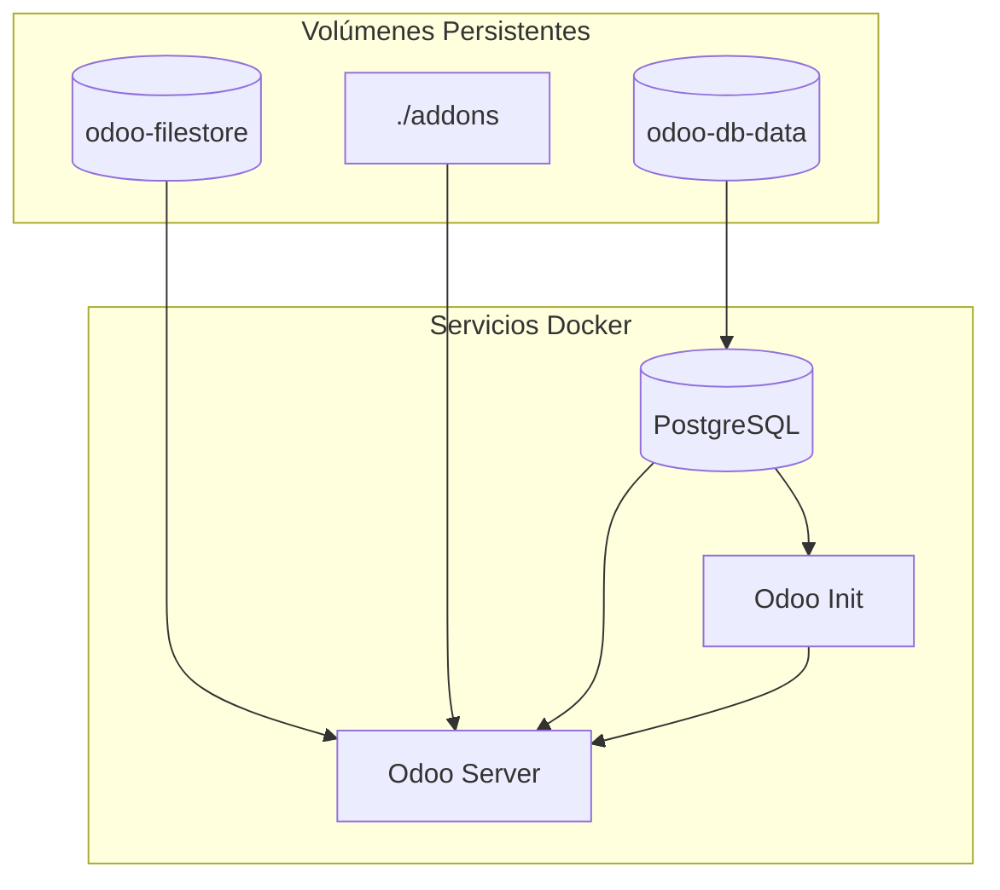
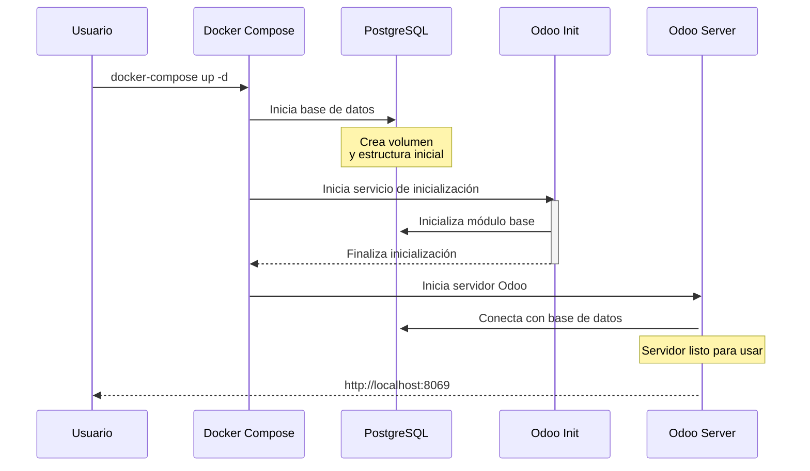

# Odoo Dockerizado

Este proyecto permite levantar un entorno aislado de Odoo usando Docker y Docker Compose, ideal para pruebas y simulaciones de administración.

## Requisitos

- Docker
- Docker Compose

## Uso

1. Clona el repositorio.
2. Copia tus módulos personalizados en la carpeta `addons` (esta carpeta será compartida entre todas las versiones de Odoo).
3. Elige la versión de Odoo que deseas levantar:
   - Abre el archivo `docker-compose.yml`.
   - Por defecto, está configurado para Odoo 16 (`./docker/16.0`).
   - Si quieres usar Odoo 17 u Odoo 18:
     - Comenta el bloque del servicio `odoo` actual.
     - Descomenta el bloque correspondiente a la versión que desees (`./docker/17.0` o `./docker/18.0`).
   - Solo debe haber un servicio `odoo` activo a la vez.
4. Construye y levanta los servicios:

   ```bash
   docker-compose up --build
   ```

5. Accede a Odoo en [http://localhost:8069](http://localhost:8069).

## Arquitectura y Flujo de Inicialización

El proyecto utiliza una arquitectura basada en contenedores Docker que se comunican entre sí. Aquí está el diagrama de la arquitectura:



### Proceso de Inicialización Automática

El sistema está diseñado para inicializarse automáticamente siguiendo esta secuencia:



El proceso de inicialización automática realiza las siguientes tareas:

1. Inicia la base de datos PostgreSQL
2. Ejecuta un servicio temporal que inicializa la base de datos con el módulo base
3. Inicia el servidor Odoo principal una vez que la inicialización está completa

Todo esto sucede automáticamente al ejecutar:

```bash
docker-compose up -d
```

## Variables de entorno

- `POSTGRES_DB`: Nombre de la base de datos (por defecto: odoo)
- `POSTGRES_USER`: Usuario de la base de datos (por defecto: odoo)
- `POSTGRES_PASSWORD`: Contraseña de la base de datos (por defecto: odoo)

## Volúmenes

- `odoo-db-data`: Datos persistentes de PostgreSQL.
- `odoo-filestore`: Archivos adjuntos de Odoo.
- `./addons`: Carpeta compartida de módulos personalizados para todas las versiones.

## Personalización

Puedes modificar el archivo `docker-compose.yml` para cambiar la versión de Odoo, los puertos, o agregar variables de entorno adicionales según tus necesidades.

## Guía de comandos útiles para tu demo

A continuación tienes una lista de comandos prácticos para demostrar tu manejo de Odoo en este entorno dockerizado:

### 1. Acceder a la terminal del contenedor Odoo
```bash
docker-compose exec odoo bash
```

### 2. Instalar un módulo personalizado desde la terminal
```bash
docker-compose exec odoo odoo -u nombre_modulo -d nombre_base
```
Reemplaza `nombre_modulo` por el nombre de tu módulo y `nombre_base` por el nombre de la base de datos.

### 3. Actualizar todos los módulos
```bash
docker-compose exec odoo odoo -u all -d nombre_base
```

### 4. Acceder al shell interactivo de Odoo (modo desarrollador)
```bash
docker-compose exec odoo odoo shell -d nombre_base
```

### 5. Ver logs en tiempo real del contenedor Odoo
```bash
docker-compose logs -f odoo
```

### 6. Crear un superusuario desde la terminal (si es necesario)
```bash
docker-compose exec odoo odoo --init=base --db-filter=^nombre_base$
```

### 7. Realizar backup de la base de datos
```bash
docker-compose exec db pg_dump -U odoo nombre_base > backup.sql
```

### 8. Restaurar un backup de la base de datos
```bash
docker-compose exec -T db psql -U odoo -d nombre_base < backup.sql
```

### 9. Instalar dependencias adicionales (desde bash del contenedor)
```bash
apt-get update && apt-get install -y nombre_paquete
```

### 10. Cambiar la versión de Odoo
- Edita el archivo `docker-compose.yml` y cambia el contexto de build del servicio `odoo` a la versión deseada (`./docker/16.0`, `./docker/17.0`, `./docker/18.0`).
- Vuelve a levantar el entorno:
```bash
docker-compose down
# Edita el compose
docker-compose up --build
```

---

Estos comandos te permitirán mostrar control total sobre el entorno, la gestión de módulos, la administración de la base de datos y la personalización de Odoo en tu demo.

---

**Recuerda:** Solo debes tener un bloque de servicio `odoo` activo a la vez para evitar conflictos de puertos y volúmenes. 

## Licencia

Este proyecto está licenciado bajo los términos de la GNU Lesser General Public License v3.0 (LGPLv3), igual que la implementación oficial de Odoo utilizada como base.
Consulta el archivo LICENSE para más detalles.